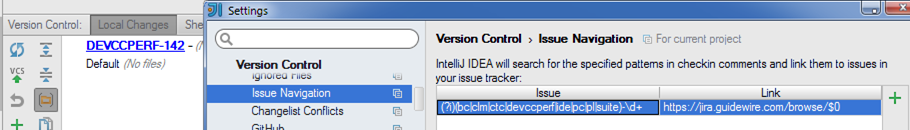

# Launch URL from a String
**IntelliJ Plugin**

## Summary
Enables hyperlink navigation from any matching string literal, XML attribute value, or XML element text to a URL defined by the "Issue Navigation" rules in the VCS settings.

## Background
Out of the box IntelliJ lets you define Regular Expressions to turn plain-text entries in your check-in comments and branch names into hyperlinks. The most common use case is to link issues back to your issue tracker. For instance the pattern and mapping shown here 
 

has turned the branch name ("DEVCCPERF-142") into a link to that case in a Jira installation.

## This Plugin
This plugin applies those same rules to quoted literal strings, XML attributes and XML element text. Now annotations like this
`@TestCase("DEVCCPERF-142")` become hyperlinks, too. Of course you can define link patterns to go anywhere you like: for instance you could link `[Ww]ikipedia:(.*)` to `http://en.wikipedia.org/w/index.php?title=Special:Search&search=$1`

###Limitations
The Regex patterns are matched against single literal String values. This means things like `"DEVCCPERF" + "-142" won't match.

 ###Supported Languages
- [Dart](https://www.dartlang.org/)
- [Gosu](https://gosu-lang.github.io/)
- [JavaScript](https://www.javascript.com/)
- [Java](https://www.java.com/en/)
- [Kotlin](https://kotlinlang.org/)
- [Scala](https://www.scala-lang.org/)
- [Php](http://www.php.net/)
- [Python](https://www.python.org/)
- \[Some other language] - Probably not*

* The Strings are found by navigating the PSI parse tree. This means that this feature will only work with languages whose Strings are represented by `com.intellij.psi.PsiLiteral` (like Java and Scala), or whose String PSI literal class is explicitly handled in this plugin. 

 
 #Installation Instructions
 Install it like a normal plugin, then restart. Define a few Regex mappings under File/Settings/Version Control/Issue Navigation. Now you should be able to CTRL-click on matching Strings.
 
 #Source Code
 This plugin is written in Kotlin. The source is available on [GitHub](https://github.com/paulschaaf/launch-url-from-string) under the Apache License.
 